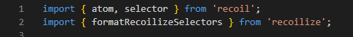
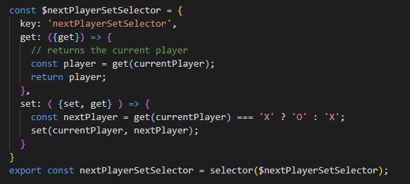
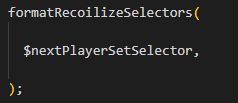
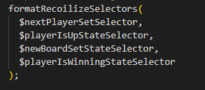
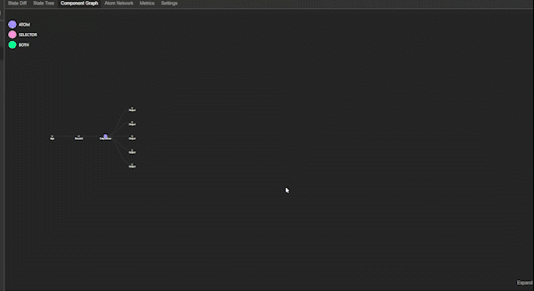
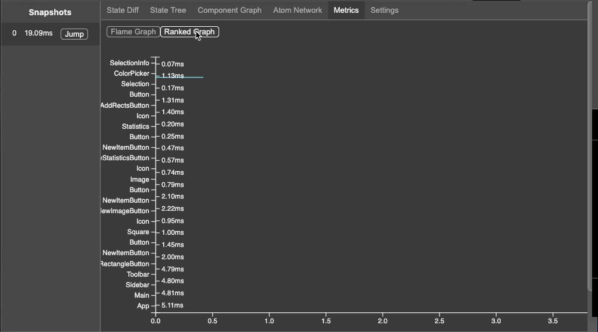

<meta name='keywords' content='Recoil, Recoil.js, Recoil Dev Tool, Recoilize, Chrome Dev Tool, Recoil Chrome'>

<p align='center'>

</p>

<h1>Debugger for Recoil Applications</h1>

# [](https://github.com/oslabs-beta/Recoilize/blob/staging/LICENSE) [](https://www.npmjs.com/package/recoilize) 

[Korean README 한국어](README_KO.md)

<h1> About</h1>
<p>
Recoilize is a Chrome Dev Tool meant for debugging applications built with the experimental Recoil.js state management library.

The tool records Recoil state and allows users to easily debug their applications with features such as: time travel to previous states, visualization of the component graph and display of the atom selector network.

</p>

<p>
Download Recoilize from the <a href='https://chrome.google.com/webstore/detail/recoilize/jhfmmdhbinleghabnblahfjfalfgidik'>Chrome Store</a>
</p>

<p>Visit the Recoilize <a href='https://www.recoilize.io/'>landing page</a> to demo</p>

<h2>
** STILL IN BETA **
</h2>

<p>Please note that Recoilize is in BETA. We will continue to make improvements and implement fixes but if you find any issues, please dont hesitate to report them in the issues tab or submit a PR and we'll happily take a look.</p>

<h1>
Installation
</h1>

#### Install Recoilize Module

```js
npm install recoilize
```

### ** IMPORTANT **

#### Import RecoilizeDebugger from the Recoilize module

```js
import RecoilizeDebugger from 'recoilize';
```

#### Integrate RecoilizeDebugger as a React component within the recoil root:

```js
import RecoilizeDebugger from 'recoilize';
import RecoilRoot from 'recoil';

ReactDOM.render(
  <RecoilRoot>
    <RecoilizeDebugger />
    <App />
  </RecoilRoot>,
  document.getElementById('root'),
);
```

#### Please note, Recoilize assumes that the HTML element used to inject your React application has an ID of 'root'. If it does not the HTML element must be passed in as an attribute called 'root' to the RecoilizeDebugger component

#### Example:

```js
import RecoilizeDebugger from 'recoilize';
import RecoilRoot from 'recoil';

//If your app injects on an element with ID of 'app'
const app = document.getElementById('app');

ReactDOM.render(
  <RecoilRoot>
    <RecoilizeDebugger root={app} />
    <App />
  </RecoilRoot>,
  app,
);
```

### In order to integrate Next.js applications with RecoilizeDebugger, follow the example below. 

```js
//If your application uses Next.js modify the _app.js as follows
import dynamic from 'next/dynamic';
import { useEffect, useState } from 'react';
import { RecoilRoot } from 'recoil';

function MyApp({ Component, pageProps }) {

  const [root, setRoot] = useState(null)
  const RecoilizeDebugger = dynamic(
	() => {
	  return import('recoilize');
	},
	{ ssr: false}
  );

  useEffect(() => {

    if (typeof window.document !== 'undefined') {
      setRoot(document.getElementById('__next'));
    }
  }, [root]);
 
  return (
    <>
    <RecoilRoot>
      <RecoilizeDebugger root = {root}/>
      <Component {...pageProps} />
    </RecoilRoot>
    </>
  );
}


export default MyApp;

```

## If you would like to use the Testing Window...
### --Important-- <br>
<p>formatRecoilizeSelectors is expecting you to update your atoms with writeable selectors. If you are using anything else to update your atom values, they will not be able to be read by the testing window. Furthermore, for atom/selector dependencies to be registered, you have to fire off a change in state before you choose a selector from the dropdown. Choosing a selector too soon will break the page.</p>

<p>First, import formatRecoilizeSelectors from Recoilize.</p>

<div>

</div>

<p>Next, format what will become your selectors as plain objects with the appropriate properties and methods. Then pass that object into the selector function. --</p>

Example:
<div>

</div>

<p>At the bottom of your file, you will need to pass that same object to the formatRecoilizeSelectors function. --</p>

<div>

</div>

<p>Repeat this process for all objects that you will use to create recoil selectors, and pass them all in at the same time. Please note that using formatRecoilSelectors more than once in your application will break the testing window and you have to pass in all objects-to-be-used-as-state at the same time. --</p>

<div>

</div>

#### Open your application on the Chrome Browser and start debugging with Recoilize!

##### (Only supported with React applications using Recoil as state management)

<h1>New Features for Version 3.1.0</h1>
<h3>Support for Recoil 0.1.3</h3>
<p>Recoilize now supports the most recent update to the Recoil library and is backwards compatible with older versions of Recoil.</p>

<h3>Time Travel with ease</h3>
<p>If you had used Recoilize before, you would have noticed an annoying bug that sometimes breaks the app and won’t allow you to be productive. With the new version of Recoilize, that issue is forever gone. Users can now use the tool with confidence and worry-free.</p>

<p>The main mission of Recoilize 3.0 is to make it more user-friendly, so you will enjoy our brand new time travel feature — the time travel slider! Why click and scroll through snapshots when you can do it with a slider and some buttons, right?</p>

<p align='center'> 

</p>

<h3>Customizable Component Graph</h3>
<p>This is one of the coolest updates of Recoilize 3.0. We understand that different users have different ways of thinking and visualizing, and for that reason, the component tree now is fully customizable. You can expand or collapse the components, choose vertical or horizontal displays or adjust the spacing between elements.</p>

<p align='center'> 

</p>

<h3>Better User Experience with Atom Network</h3>
<p>The atom network is one of the key features that differentiate Recoil.js from other alternative state management libraries. However, the atom network will grow bigger together with the app. At some points, it will be unmanageable and hard to keep track of all of the atoms. To make this easier and pain-free, the new Atom Network will allow you to freely move and arrange them anywhere you want.</p>

<p align='center'> 

</p>

<h3>Snapshot Comparison</h3>
<p>We understand that developers always develop an app with an optimization philosophy in mind. Component rendering time can be difficult to measure for two reasons. First, your computer and your web browser are not the same as mine, so the run-time can be vastly different. Second, it’s really hard to keep track of a long series of snapshots. You definitely don’t want to waste all of your time calculating the rendering time by hand.</p>

<p>With the new Recoilize, users can now save a series of state snapshots and use it later to analyze/compare with the current series.</p>

<p align='center'> 

</p>
<h3>Testing Window</h3>

<p>As engineers, testing is an invaluable process to ensure the strength of one's application. Without implementing testing on one's application, engineers expose themselves to problems that could have been sought out proactively. With our Recoilize Testing Window, we allow users to implement Recoil testing for specific recoil selectors within their application. Within our testing window, users can review the code behind their selectors, analyze node-to-node subscriptions and dependencies, and test for an expected output of an atom's value, all completely independent of your application's state management.</p>

<div align='center'>

</div>

<h1>Features</h1>
<h3>Support for Concurrent Mode</h3>
<p>If a Suspense component was used as a placeholder during component renderings, those suspense components will display with a red border in the expanded component graph. This indicates that a component was suspended during the render of the selected snapshot.</p>

<p align='center'> 

</p>

<h3>Performance Metrics</h3>
<p>In 'Metrics' tab, two graphs display component render times.

The flame graph displays the time a component took to render itself, and all of its child components. The bar graph displays the individual render times of each component.<p>

<!-- <p align='center'>

</p> -->

<h3>Throttle</h3>
<p>In the settings tab, users are able to set throttle (in milliseconds) for large scale applications or any applications that changes state rapidly. The default is set at 70ms.<p>

<h3>State Persistence</h3>
<p>Recoilize allows the users to persist their application's state through a refresh or reload. At this time, the user is able to view the previous states in the dev tool, but cannot time travel to the states before refresh.</p>

<h3>Additional Features</h3>
<ul><li>legend to see relationship between component graph and state</li></ul>
<ul><li>toggle to view raw component graph</li></ul>
<ul><li>filter atom/selector network relationship</li></ul>
<ul><li>filter snapshots by atom/selector keys</li></ul>

<h2> We will continue updating Recoilize alongside Recoil's updates!</h2>

<h1>
 Contributors
</h1>

<h4>Bren Yamaguchi <a href='https://github.com/brenyama' target=“_blank”>@github </a><a  href='https://www.linkedin.com/in/brenyamaguchi/' target=“_blank”>@linkedin</a></h4>

<h4>Saejin Kang <a  href='https://github.com/skang1004' target=“_blank”>@github </a><a  href='https://www.linkedin.com/in/saejinkang1004/' target=“_blank”>@linkedin</a></h4>

<h4>Jonathan Escamila <a  href='https://github.com/jonescamilla' target=“_blank”>@github </a><a  href='https://www.linkedin.com/in/jon-escamilla/' target=“_blank”>@linkedin</a> </h4>

<h4>Sean Smith <a  href='https://github.com/SmithSean17' target=“_blank”>@github </a><a  href='https://www.linkedin.com/in/sean-smith17/' target=“_blank”>@linkedin</a> </h4>

<h4>Justin Choo <a href='https://github.com/justinchoo93' target=“_blank”>@github </a><a  href='https://www.linkedin.com/in/justinchoo93/' target=“_blank”>@linkedin</a></h4>

<h4>Anthony Lin <a  href='https://github.com/anthonylin198' target=“_blank”>@github </a><a  href='https://www.linkedin.com/in/anthony-lin/' target=“_blank”>@linkedin</a></h4>

<h4>Spenser Schwartz <a  href='https://github.com/spenserschwartz' target=“_blank”>@github </a><a  href='https://www.linkedin.com/in/spenser-schwartz/' target=“_blank”>@linkedin</a> </h4>

<h4>Steven Nguyen <a  href='https://github.com/Steven-Nguyen-T' target=“_blank”>@github </a><a  href='https://www.linkedin.com/in/steven-nguyen-t/' target=“_blank”>@linkedin</a> </h4>

<h4>Henry Taing <a  href='https://github.com/henrytaing' target=“_blank”>@github </a><a  href='https://www.linkedin.com/in/henrytaing/' target=“_blank”>@linkedin</a> </h4>

<h4>Seungho Baek <a  href='https://github.com/hobaek' target=“_blank”>@github </a><a  href='https://www.linkedin.com/in/s2unghobaek/' target=“_blank”>@linkedin</a> </h4>

<h4>Aaron Yang <a  href='https://github.com/aaronyang24' target=“_blank”>@github </a><a  href='https://www.linkedin.com/in/aaronyang24/' target=“_blank”>@linkedin</a> </h4>

<h4>Jesus Vargas <a  href='https://github.com/jmodestov' target=“_blank”>@github </a><a  href='https://www.linkedin.com/in/jesus-modesto-vargas/' target=“_blank”>@linkedin</a> </h4>

<h4>Davide Molino <a  href='https://github.com/davidemmolino' target=“_blank”>@github </a><a  href='https://www.linkedin.com/in/davide-molino/' target=“_blank”>@linkedin</a> </h4>

<h4>Taven Shumaker <a  href='https://github.com/TavenShumaker' target=“_blank”>@github </a><a  href='https://www.linkedin.com/in/Taven-Shumaker/' target=“_blank”>@linkedin</a> </h4>

<h4>Janis Hernandez <a  href='https://github.com/Janis-H' target=“_blank”>@github </a><a  href='https://www.linkedin.com/in/janis-h/' target=“_blank”>@linkedin</a> </h4>

<h4>Jaime Baik <a  href='https://github.com/jaimebaik' target=“_blank”>@github </a><a  href='https://www.linkedin.com/in/jaime-baik/' target=“_blank”>@linkedin</a> </h4>

<h4>Anthony Magallanes <a  href='https://github.com/amagalla' target=“_blank”>@github </a><a  href='https://www.linkedin.com/in/anthony-magallanes/' target=“_blank”>@linkedin</a> </h4>

<h4>Edward Shei <a  href='https://github.com/calibeach' target=“_blank”>@github </a><a  href='https://www.linkedin.com/in/edwardshei/' target=“_blank”>@linkedin</a> </h4>

<h4>Nathan Bargers <a  href='https://github.com/nbargers' target=“_blank”>@github </a><a  href='https://www.linkedin.com/in/nathan-bargers/' target=“_blank”>@linkedin</a> </h4>

<h4>Scott Campbell <a  href='https://github.com/thisisscottcampbell' target=“_blank”>@github </a><a  href='https://www.linkedin.com/in/thisisscottcampbell/' target=“_blank”>@linkedin</a> </h4>

<h4>Steve Hong <a  href='https://github.com/stevehong423' target=“_blank”>@github </a><a  href='https://www.linkedin.com/in/stevehongpa/' target=“_blank”>@linkedin</a> </h4>

<h4>Jason Lee <a  href='https://github.com/j4s0n1020' target=“_blank”>@github </a><a  href='https://www.linkedin.com/in/jasonjml/' target=“_blank”>@linkedin</a> </h4>

<h4>Razana Nisathar <a  href='https://github.com/razananisathar' target=“_blank”>@github </a><a  href='http://www.linkedin.com/in/razananisathar' target=“_blank”>@linkedin</a> </h4>

<h4>Harvey Nguyen <a  href='https://github.com/harveynwynn' target=“_blank”>@github </a><a  href='https://www.linkedin.com/in/harveynwynn' target=“_blank”>@linkedin</a> </h4>

<h4>Joey Ma <a  href='https://github.com/yoyoyojoe' target=“_blank”>@github </a><a  href='https://www.linkedin.com/in/joeyma' target=“_blank”>@linkedin</a> </h4>

<h4>Leonard Lew <a  href='https://github.com/leolew97' target=“_blank”>@github </a><a  href='https://www.linkedin.com/in/leonardlew' target=“_blank”>@linkedin</a> </h4>

<h4>Victor Wang <a  href='https://github.com/wangvwr' target=“_blank”>@github </a><a  href='https://www.linkedin.com/in/wangvwr' target=“_blank”>@linkedin</a> </h4>

<h4>Adam Allison <a  href='https://github.com/allisonadam81' target=“_blank”>@github </a><a  href='https://www.linkedin.com/in/allisonadam81/' target=“_blank”>@linkedin</a> </h4>

<h4>William Chu <a  href='https://github.com/wi11chu' target=“_blank”>@github </a><a  href='https://www.linkedin.com/in/williamchu9/' target=“_blank”>@linkedin</a> </h4>

<h4>Jordan Rice <a  href='https://github.com/JordanMRice' target=“_blank”>@github </a><a  href='https://www.linkedin.com/in/theoriginaljordanrice/' target=“_blank”>@linkedin</a> </h4>

<h4>Ryan Wallace <a  href='https://github.com/RWallie' target=“_blank”>@github </a><a  href='https://www.linkedin.com/in/rwallie/' target=“_blank”>@linkedin</a> </h4>
