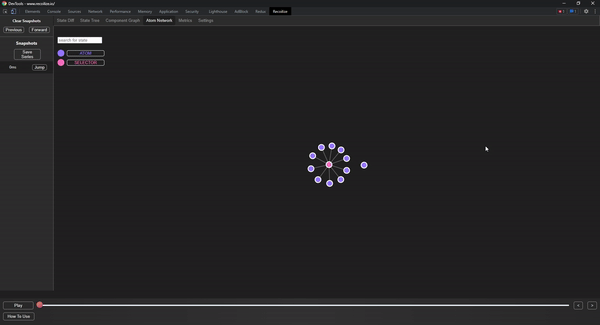
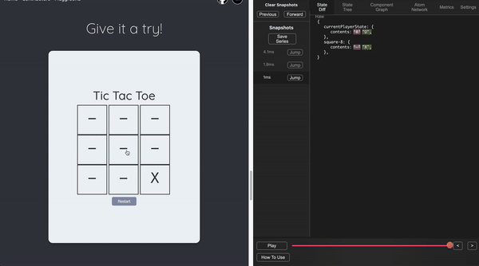
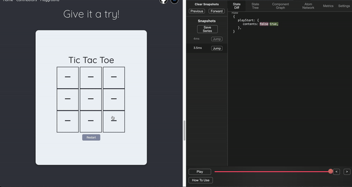
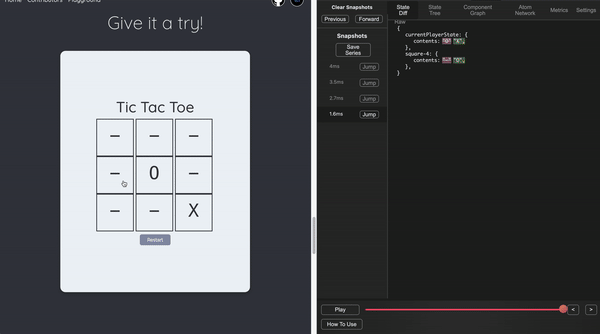

<meta name='keywords' content='Recoil, Recoil.js, Recoil Dev Tool, Recoilize, Chrome Dev Tool, Recoil Chrome'>

<a name="readme-top"></a>

<p align='center'>

</p>

# A Dev Tool for Recoil Applications

# [](https://github.com/open-source-labs/Recoilize/graphs/contributors) [](https://www.npmjs.com/package/recoilize) [](https://github.com/oslabs-beta/Recoilize/blob/staging/LICENSE) 

[Korean README 한국어](README_KO.md) (this README is not up to date with the latest README)

<br />

# About

[![Typescript][TS.js]][TS-url]
[![JavaScript][JavaScript]][JavaScript-url]
[![React][React.js]][React-url]
[![Redux][Redux]][Redux-url]
[![RTK][RTK]][RTK-url]
[![D3][D3.js]][d3-url]
[![Node][Node.js]][Node-url]
[![Jest][Jest]][Jest-url]
[![Testing][Testing-Library]][Testing-Library-url]
[![Git][Git]][Git-url]
[![HTML5][HTML5]][HTML5-url]
[![CSS3][CSS3]][CSS3-url]


<br />

Recoilize is a Chrome Dev Tool designed for debugging applications built with the Recoil.js state management library.

The tool records Recoil state and allows users to easily debug their applications with features such as time travel to previous states, visualization of the component graph and display of the atom selector network.

<br />

Download Recoilize from the [Chrome Store](https://chrome.google.com/webstore/detail/recoilize/jhfmmdhbinleghabnblahfjfalfgidik)


Visit the Recoilize [landing page](https://www.recoilize.io/) to demo


<br />
<br />

# Installation
## Standard Installation:
For installation in applications using React.js, follow the instructions below.

<br />

Install Recoilize Module (only available as an npm package)
```js
npm install recoilize
```
<br />

Import RecoilizeDebugger from the Recoilize module

```js
import RecoilizeDebugger from 'recoilize';
```
<br />

Integrate RecoilizeDebugger as a React component within the recoil root:

```js
import RecoilizeDebugger from 'recoilize';
import RecoilRoot from 'recoil';

root.render(
  <RecoilRoot>
    <RecoilizeDebugger />
    <App />
  </RecoilRoot>,
  document.getElementById('root'),
);
```

*Please note, Recoilize assumes that the HTML element used to inject your React application **has an ID of 'root'**. If it does not, the HTML element must be passed in as an attribute called 'root' to the RecoilizeDebugger component*

**Example:**

```js
import RecoilizeDebugger from 'recoilize';
import RecoilRoot from 'recoil';

//If your app injects on an element with ID of 'app'
const app = document.getElementById('app');

root.render(
  <RecoilRoot>
    <RecoilizeDebugger root={app} />
    <App />
  </RecoilRoot>,
  app,
);
```
<br />
<br />


## Using Next.js:
In order to integrate Next.js applications with RecoilizeDebugger, follow the example below. 

```js
//If your application uses Next.js modify the _app.js as follows
import dynamic from 'next/dynamic';
import { useEffect, useState } from 'react';
import { RecoilRoot } from 'recoil';

function MyApp({ Component, pageProps }) {

  const [root, setRoot] = useState(null)
  const RecoilizeDebugger = dynamic(
	() => {
	  return import('recoilize');
	},
	{ ssr: false}
  );

  useEffect(() => {

    if (typeof window.document !== 'undefined') {
      setRoot(document.getElementById('__next'));
    }
  }, [root]);
 
  return (
    <>
    <RecoilRoot>
      <RecoilizeDebugger root = {root}/>
      <Component {...pageProps} />
    </RecoilRoot>
    </>
  );
}


export default MyApp;

```
<br />
<br />

Once you have completed the steps above, open your application in Chrome, select the Recoilize Chrome extension, refresh the page*, and you're ready to start debugging with Recoilize!

<br />

##### *The Chrome Extension is only supported with React applications using Recoil as state management*

##### **note that you may need to refresh your page before the extension registers that the Recoilize npm package has been installed within the application. This is a known bug that needs to be addressed*

<br />
<br />

# Updates for Version 4.0

### <u>Manifest 3</u>

Google is transitioning Chrome Extensions to Manifest v3. Soon, Manifest v2 will be phased out, and only extensions using Manifest v3 will be accepted and listed in the Chrome store. Because of this, one of the primary focuses for Recoilize 4.0 was to update the Chrome Extension to Manifest v3. With this update, users will still be able to utilize this amazing tool, as it has now been updated and complies with Manifest v3 requirements.

<br />

### <u>React 17 and 18 Compatibility</u>

Recoilize is now compatible with React 17 and 18. 

<br />

### <u>Support for Recoil 0.1.3???</u>

Recoilize now supports the most recent update to the Recoil library and is backwards compatible with older versions of Recoil.

<br />

### <u>Under the Hood</u>
* Deprecated dependencies have been updated
* React has been updated from 16 to 17
* Increased testing coverage
* Cleaner codebase for improved readability


<br />
<br />


# Features 
### <u>Atom Network</u>

Easily visualize the relationship between atoms and selectors (the bread and butter of Recoil.js) with the use of the Atom Network.

<br />

<p align='center'> 

</p>

<br />

### <u>Snapshot Comparison</u>

Optimizing your app is key. Component rendering time can be difficult to keep track of if you have a long series of snapshots, and render time can vary depending on the browser and device used. Users can save a series of state snapshots and use it later to analyze and compare with the most up to date series.

<br />

<p align='center'> 

</p>

<br />

### <u>Time Travel with ease</u>

Users may travel through their snapshot history with the use of a slider or buttons.

<br />

<p align='center'> 

</p>

<br />

### <u>Customizable Component Graph</u>

The component graph allows users to visualize the relationship between components and how they are rendered.

Users have the ability to customize how they view the component graph. Components can be expanded or collapsed, and can also be displayed horizontally or vertically, depending on the users preference.

<br />

<p align='center'> 

</p>

<br />

### <u>Performance Metrics</u>

In 'Metrics' tab, two graphs display component render times.

The flame graph displays the time a component took to render itself, and all of its child components. The bar graph displays the individual render times of each component.

<br />

### <u>Throttle</u>

In the settings tab, users are able to set throttle (in milliseconds) for large scale applications or any applications that changes state rapidly. The default is set at 70ms.

<br />

### <u>State Persistence</u>

Recoilize allows the users to persist their application's state through a refresh or reload. At this time, the user is able to view the previous states in the dev tool, but cannot time travel to the states before refresh.

<br />

### <u>Additional Features</u>

* legend to see relationship between component graph and state
* toggle to view raw component graph
* filter atom/selector network relationship
* filter snapshots by atom/selector keys

<br />


<br />
<br />

# Contributors

Bren Yamaguchi | [github](https://github.com/brenyama)  | [linkedin](https://www.linkedin.com/in/brenyamaguchi/)


Saejin Kang | [github](https://github.com/skang1004) | [linkedin](https://www.linkedin.com/in/saejinkang1004/)


Jonathan Escamila | [github](https://github.com/jonescamilla) | [linkedin](https://www.linkedin.com/in/jon-escamilla/)


Sean Smith | [github](https://github.com/SmithSean17) | [linkedin](https://www.linkedin.com/in/sean-smith17/)


Justin Choo | [github](https://github.com/justinchoo93) | [linkedin](https://www.linkedin.com/in/justinchoo93/)


Anthony Lin | [github](https://github.com/anthonylin198) | [linkedin](https://www.linkedin.com/in/anthony-lin/)


Spenser Schwartz | [github](https://github.com/spenserschwartz) | [linkedin](https://www.linkedin.com/in/spenser-schwartz/)


Steven Nguyen | [github](https://github.com/Steven-Nguyen-T) | [linkedin](https://www.linkedin.com/in/steven-nguyen-t/)


Henry Taing | [github](https://github.com/henrytaing) | [linkedin](https://www.linkedin.com/in/henrytaing/)


Seungho Baek | [github](https://github.com/hobaek) | [linkedin](https://www.linkedin.com/in/s2unghobaek/)


Aaron Yang | [github](https://github.com/aaronyang24) | [linkedin](https://www.linkedin.com/in/aaronyang24/)


Jesus Vargas | [github](https://github.com/jmodestov) | [linkedin](https://www.linkedin.com/in/jesus-modesto-vargas/)


Davide Molino | [github](https://github.com/davidemmolino) | [linkedin](https://www.linkedin.com/in/davide-molino/)


Taven Shumaker | [github](https://github.com/TavenShumaker) | [linkedin](https://www.linkedin.com/in/Taven-Shumaker/)


Janis Hernandez | [github](https://github.com/Janis-H) | [linkedin](https://www.linkedin.com/in/janis-h/)


Jaime Baik | [github](https://github.com/jaimebaik) | [linkedin](https://www.linkedin.com/in/jaime-baik/)


Anthony Magallanes | [github](https://github.com/amagalla) | [linkedin](https://www.linkedin.com/in/anthony-magallanes/)


Edward Shei | [github](https://github.com/calibeach) | [linkedin](https://www.linkedin.com/in/edwardshei/)


Nathan Bargers | [github](https://github.com/nbargers) | [linkedin](https://www.linkedin.com/in/nathan-bargers/)


Scott Campbell | [github](https://github.com/thisisscottcampbell) | [linkedin](https://www.linkedin.com/in/thisisscottcampbell/)


Steve Hong | [github](https://github.com/stevehong423) | [linkedin](https://www.linkedin.com/in/stevehongpa/)


Jason Lee | [github](https://github.com/j4s0n1020) | [linkedin](https://www.linkedin.com/in/jasonjml/)


Razana Nisathar | [github](https://github.com/razananisathar) | [linkedin](http://www.linkedin.com/in/razananisathar)


Harvey Nguyen | [github](https://github.com/harveynwynn) | [linkedin](https://www.linkedin.com/in/harveynwynn)


Joey Ma | [github](https://github.com/yoyoyojoe) | [linkedin](https://www.linkedin.com/in/joeyma)


Leonard Lew | [github](https://github.com/leolew97) | [linkedin](https://www.linkedin.com/in/leonardlew)


Victor Wang | [github](https://github.com/wangvwr) | [linkedin](https://www.linkedin.com/in/wangvwr)


Adam Allison | [github](https://github.com/allisonadam81) | [linkedin](https://www.linkedin.com/in/allisonadam81/)


William Chu | [github](https://github.com/wi11chu) | [linkedin](https://www.linkedin.com/in/williamchu9/)


Jordan Rice | [github](https://github.com/JordanMRice) | [linkedin](https://www.linkedin.com/in/theoriginaljordanrice/)


Ryan Wallace | [github](https://github.com/RWallie) | [linkedin](https://www.linkedin.com/in/rwallie/)


Alejandro Florez | [github](https://github.com/AlejandroFlorez) | [linkedin](https://www.linkedin.com/in/florezalejandro/)


Anne-lise Emig | [github](https://github.com/annelise08) | [linkedin](https://www.linkedin.com/in/anne-lise-emig/)


Giovana De La Cruz | [github](https://github.com/giovanacdlc) | [linkedin]()


Kasey Wolff | [github](https://github.com/kaseywolff) | [linkedin](https://www.linkedin.com/in/kaseywolff/)


<p align="right"><a href="#readme-top">back to top</a></p>


[TS.js]: https://img.shields.io/badge/typescript-%23007ACC.svg?style=for-the-badge&logo=typescript&logoColor=white
[TS-url]: https://www.typescriptlang.org/
[JavaScript]: https://img.shields.io/badge/javascript-%23323330.svg?style=for-the-badge&logo=javascript&logoColor=%23F7DF1E
[JavaScript-url]: https://www.javascript.com/
[React.js]: https://img.shields.io/badge/react-%2320232a.svg?style=for-the-badge&logo=react&logoColor=%2361DAFB
[React-url]: https://reactjs.org/
[Redux]: https://img.shields.io/badge/redux-%23593d88.svg?style=for-the-badge&logo=redux&logoColor=white
[Redux-url]: https://redux.js.org/
[RTK]: https://img.shields.io/badge/RTK-563D7C?style=for-the-badge&logo=redux&logoColor=white
[RTK-url]: https://redux-toolkit.js.org/
[Node.js]: https://img.shields.io/badge/node.js-6DA55F?style=for-the-badge&logo=node.js&logoColor=white
[Node-url]: https://nodejs.org/en/
[D3.js]: https://img.shields.io/badge/d3.js-F9A03C?style=for-the-badge&logo=d3.js&logoColor=white
[d3-url]: https://d3js.org/
[Jest]: https://img.shields.io/badge/-jest-%23C21325?style=for-the-badge&logo=jest&logoColor=white
[Jest-url]: https://jestjs.io/
[Testing-Library]:https://img.shields.io/badge/testing%20library-E33332?style=for-the-badge&logo=testing-library&logoColor=white
[Testing-Library-url]: https://testing-library.com/ 
[Git]: https://img.shields.io/badge/git-%23F05033.svg?style=for-the-badge&logo=git&logoColor=white
[Git-url]: https://git-scm.com/
[CSS3]: https://img.shields.io/badge/css3-%231572B6.svg?style=for-the-badge&logo=css3&logoColor=white
[CSS3-url]: https://www.w3schools.com/css/
[HTML5]: https://img.shields.io/badge/html5-%23E34F26.svg?style=for-the-badge&logo=html5&logoColor=white
[HTML5-url]: https://www.w3schools.com/html/