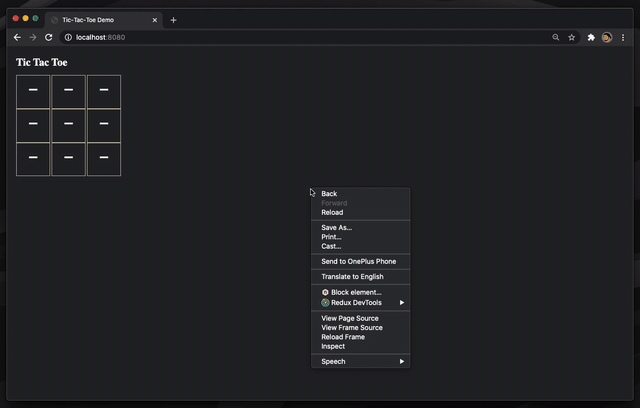
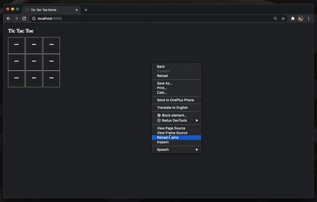
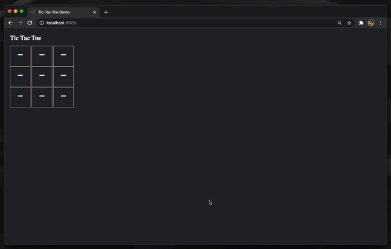
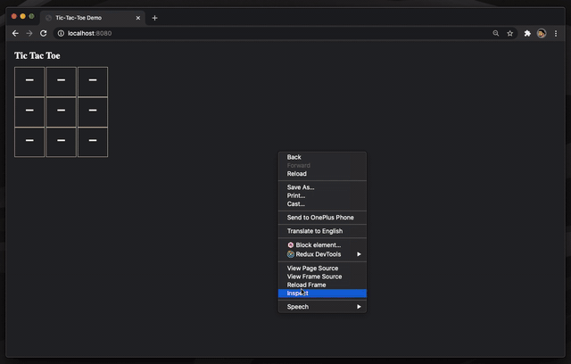
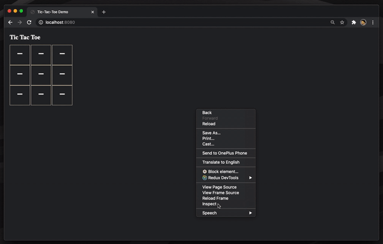

<meta name='keywords' content='Recoil, Recoil.js, Recoil Dev Tool, Recoilize, Chrome Dev Tool, Recoil Chrome'>

<p align='center'>

</p>

# [](https://github.com/oslabs-beta/Recoilize/blob/staging/LICENSE) [](https://www.npmjs.com/package/recoilize) 

<p>
Recoilize is a Chrome Dev Tool meant for debugging applications built with the new Recoil.js state management library!
(LINK OUR CHROME EXTENSION IN THE STORE AND THE NPM MODULE)
</p>

<h1 align='center'>
** STILL IN BETA **
</h1>

<h2 align='center'>Shows the difference in atoms and selectors from the previous render</h2>
<h1 align='center'> 

</h1>

<h2 align='center'>View your atoms and selectors in a collapsible tree</h2>
<h1 align='center'> 

</h1>

<h2 align='center'>Visualize all your atom and selector values in a graph</h2>
<h1 align='center'> 

</h1>

<h2 align='center'>Display how all your atoms and selectors relate to each other</h2>
<h1 align='center'> 

</h1>

<h2 align='center'>See which of your React components are subscribed to certain atoms and selectors</h2>
<h1 align='center'> 

</h1>

<h1 align='center'>
Installation
</h1>

#### Install Recoilize Module

```js
npm install recoilize
```

### ** IMPORTANT **

#### Import RecoilizeDebugger from the Recoilize module

```js
import RecoilizeDebugger from 'recoilize';
```

#### Recoilize requires you to create a variable that grabs the HTML element where you inject your React application

```js
const root = document.getElementById('root');
```

#### You must import all Atoms and Selectors and pass them into the Recoilize component as shown above

```js
import * as nodes from './store';

<RecoilizeDebugger nodes={nodes} root={root} />;
```

#### Example:

```js
import RecoilizeDebugger from 'recoilize';
import RecoilRoot from 'recoil';
import * as nodes from './store';

const root = document.getElementById('root');

ReactDOM.render(
  <RecoilRoot>
    <RecoilizeDebugger nodes={nodes} root={root} />
    <App />
  </RecoilRoot>,
  root,
);
```

#### Get Recoilize from the Chrome Store!

#### Open your application on the Chrome Browser and start debugging with Recoilize!

##### (Only supported with React applications using Recoil as state management)

<h2 align='center'> 
We will continue updating Recoilize alongside Recoil's updates!
</h2>

<h1>
 Contributors
</h1>

<h4>Bren Yamaguchi <a target='_blank' href='https://github.com/brenyama'>@github </a><a target='_blank' href='https://www.linkedin.com/in/brenyamaguchi/'>@linkedin</a></h4>

<h4>Saejin Kang <a target='_blank' href='https://github.com/skang1004'>@github </a><a target='_blank' href='https://www.linkedin.com/in/saejinkang1004'>@linkedin</a></h4>

<h4>Jonathan Escamila <a target='_blank' href='https://github.com/jonescamilla'>@github </a><a target='_blank' href='https://www.linkedin.com/in/jon-escamilla/'>@linkedin</a> </h4>

<h4>Sean Smith <a target='_blank' href='https://github.com/SmithSean17'>@github </a><a target='_blank' href='https://www.linkedin.com/in/sean-smith17'>@linkedin</a> </h4>
