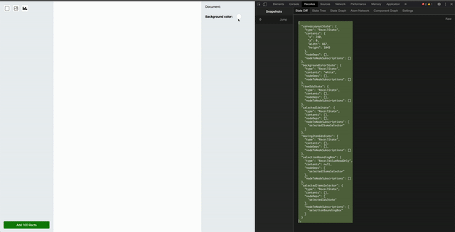
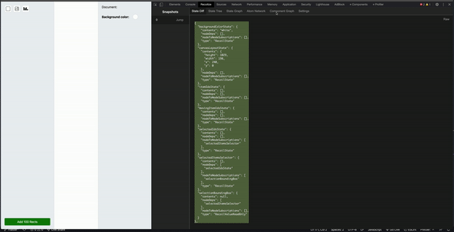

<meta name='keywords' content='Recoil, Recoil.js, Recoil Dev Tool, Recoilize, Chrome Dev Tool, Recoil Chrome'>

<p align='center'>

</p>

<h1>Recoil 애플리케이션을 위한 디버깅 개발도구</h1>
<h1 align='center'> 

</h1>

# [](https://github.com/oslabs-beta/Recoilize/blob/staging/LICENSE) [](https://www.npmjs.com/package/recoilize) 

[영어 README](README.md)

<h1>Recoilize에 대해서</h1>
<p>
Recoilize는 Recoil 상태관리 라이브러리를 사용하여 만들어진 애플리케이션을 디버깅 할수있는 Chrome Dev Tool입니다.

Recoil 상태를 기록하여 유저들이 애플리케이션을 편하게 디버깅 할수 있도록 도와주는 기능들을 가지고 있습니다. 리액트 컴포넌트를 시각화 하여 그래프로 보여줌과 동시에 스냅샷을 이요하여 이전 상태로 시간이동을 가능하게 만들어줄수있는 도구입니다.

</p>
<p>
<a href='https://chrome.google.com/webstore/detail/recoilize/jhfmmdhbinleghabnblahfjfalfgidik'>크롬 스토어</a> 에서 다운로드 받으실수 있습니다.
</p>

<p>데모  <a href='https://github.com/justinchoo93/recoil-paint'>페인트 애플리케이션</a></p>

<h2>
** 현재는 베타 버젼입니다 **
</h2>

<p>Recoilize는 현재 베타버젼 입니다. 툴을 계속 개선하고 새로운 이슈들을 수정해 나갈것이고, 혹시 다른 버그들이나 이슈들이 나타난다면 언제든지 이슈 탭에 글을 작성하시거나 PR을 해주시면 감사하겠습니다.</p>

<h1>
설치 방법
</h1>

#### Recoilize 모듈 설치

```js
npm install recoilize
```

### ** 중요 **

#### Recoilize모듈에서 RecoilizeDebugger를 import해줘야 합니다

```js
import RecoilizeDebugger from 'recoilize';
```

#### 리액트 애플리케이션을 inject하는 HTML element를 변수로 만들어 줘야 합니다

```js
const root = document.getElementById('root');
```

#### 아래와 같이 Atom들과 Selector들을 import하여 RecoilizeDebugger 컴포넌트로 넣어줘야 합니다

```js
import * as nodes from './store';

<RecoilizeDebugger nodes={nodes} root={root} />;
```

#### 예제:

```js
import RecoilizeDebugger from 'recoilize';
import RecoilRoot from 'recoil';
import * as nodes from './store';

const root = document.getElementById('root');

ReactDOM.render(
  <RecoilRoot>
    <RecoilizeDebugger nodes={nodes} root={root} />
    <App />
  </RecoilRoot>,
  root,
);
```

#### 애플리케이션을 크롬 브라우저에서 열고 Recoilize 디버깅툴을 실행하시면 됩니다.

##### (현재 Recoil을 상태관리 라이브러리로 사용하는 리액트 애플리케이션만 지원합니다.)

<h1>기능</h1>
<h3>시각화</h3>
<p>사용자는 개별 스냅샷을 클릭하여 애플리케이션 상태에 대한 시각화된 그래프를 볼수있고, 컴포넌트 트리와 다른 그래프 뿐만 아니라 State tree를 JSON 형식으로 지원합니다<p>

<p align='center'> 

</p>

<h3>시간 이동</h3>
<p>Recoilize의 주요 기능 중 하나로, 이 도구는 사용자가 이전의 모든 스냅샷으로 이동할 수 있게 해줍니다. 각 스냅샷 옆에 있는 점프 버튼을 누르면 해당 스냅샷으로 상태를 설정하여 DOM이 변경됩니다.<p>

<h3>쓰로틀링</h3>
<p>대규모 애플리케이션 또는 상태를 빠르게 변경하는 모든 애플리케이션에 대해 쓰로틀링(ms)을 설정할 수 있습니다. 기본값은 70ms로 설정되어 있습니다.<p>

<h3>상태 유지 (베타)</h3>
<p>Recoilize는 사용자가 새로 고침을 했을 경우에도 응용 프로그램의 상태를 유지할 수 있도록 해줍니다. 이때 사용자는 개발 도구에서는 이전 상태를 볼 수 있지만, 새로고침 전에 상태로의 시간 이동은 할 수 없습니다. 우리 팀은 여전히 이 기능을 완성하기 위해 노력하고 있습니다.</p>

<h3>부가 기능</h3>
<ul><li>컴포넌트 그래프에 마우스를 올렸을때 관련있는 atom과 selector들이 나타납니다</li></ul>
<ul><li>컴포넌트 그래프 안에 오른쪽 작은 창에서 관련된 상태들을 선택하여 볼  있습니다</li></ul>
<ul><li>컴포넌트 그래프 안에 Expand 버튼을 누르면 확장된 컴포넌트 그래프를 볼 수 있습니다</li></ul>
<ul><li>네트워크 그래프 안에 atom과 selector들을 볼수있고 필터링도 가능합니다.</li></ul>
<ul><li>설정탭에서 atom과 selector key를 사용하여 관련된 스냅샷들을 필터링 할 수 있습니다</li></ul>

<h2>우리는 Recoil의 업데이트와 함께 Recoilize를 계속 업데이트 할 것 입니다</h2>

<h1>
 기여
</h1>

<h4>Bren Yamaguchi <a href='https://github.com/brenyama' target="_blank">@github </a><a  href='https://www.linkedin.com/in/brenyamaguchi/' target="_blank">@linkedin</a></h4>

<h4>Saejin Kang <a  href='https://github.com/skang1004' target="_blank">@github </a><a  href='https://www.linkedin.com/in/saejinkang1004/' target="_blank">@linkedin</a></h4>

<h4>Jonathan Escamila <a  href='https://github.com/jonescamilla' target="_blank">@github </a><a  href='https://www.linkedin.com/in/jon-escamilla/' target="_blank">@linkedin</a> </h4>

<h4>Sean Smith <a  href='https://github.com/SmithSean17' target="_blank">@github </a><a  href='https://www.linkedin.com/in/sean-smith17/' target="_blank">@linkedin</a> </h4>

<h4>Justin Choo <a href='https://github.com/justinchoo93' target="_blank">@github </a><a  href='https://www.linkedin.com/in/justinchoo93/' target="_blank">@linkedin</a></h4>

<h4>Anthony Lin <a  href='https://github.com/anthonylin198' target="_blank">@github </a><a  href='https://www.linkedin.com/in/anthony-lin/' target="_blank">@linkedin</a></h4>

<h4>Spenser Schwartz <a  href='https://github.com/spenserschwartz' target="_blank">@github </a><a  href='https://www.linkedin.com/in/spenser-schwartz/' target="_blank">@linkedin</a> </h4>

<h4>Steven Nguyen <a  href='https://github.com/Steven-Nguyen-T' target="_blank">@github </a><a  href='https://www.linkedin.com/in/steven-nguyen-t/' target="_blank">@linkedin</a> </h4>

<h4>Henry Taing <a  href='https://github.com/henrytaing' target="_blank">@github </a><a  href='https://www.linkedin.com/in/henrytaing/' target="_blank">@linkedin</a> </h4>

<h4>Seungho Baek <a  href='https://github.com/hobaek' target="_blank">@github </a><a  href='https://www.linkedin.com/in/s2unghobaek/' target="_blank">@linkedin</a> </h4>
