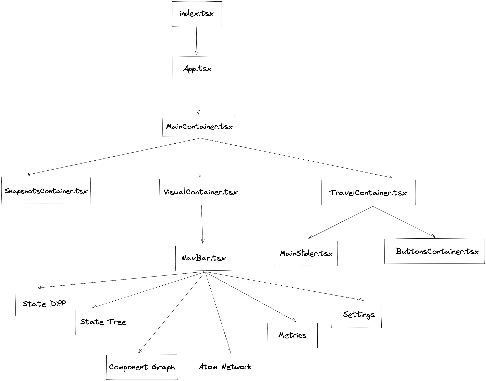

# Developer README

## Brief

Though Recoil.js is still in the experimental state, it has proved its ability and catched a tremendous amount of attentions from experience developers for the past three years. We created Recoilize with one great mission in mind - providing a helpful tool so the developers can make an easy transition to Recoil.js and making the debugging process more effective. Recoilize is an open source product that is maintained and iterated constantly, and we're always welcome developers who are interested in it. Getting on board and understanding the codebase are never easy, so here are some useful tips and information that will help you get started quickly.

## File Structure

The src folder contains Recoilize's source code - frontend and Chrome extension.

```
src/                        
├── __tests__              # Tests for all files within the app folder 
│                     
├── app                    # Code for the frontend
│   ├── Containers         # React container components
│   ├── components
│   │   ├── App.tsx        # App component
│   │   ├── AtomNetwork
│   │   ├── ComponentGraph
│   │   ├── Metrics
│   │   ├── NavBar
│   │   ├── Settings
│   │   ├── Slider
│   │   ├── StateDiff
│   │   ├── StateTree
│   │   └── Testing
│   ├── functions          # Helper functions for components, separated by file
│   ├── index.tsx          # Root file to render the app
│   ├── state-management   # Redux toolkit slices
│   └── utils              # More helper functions
├── extension              # All files related to the Chrome extension
│   ├── build              # Destination for bundles and manifest.json (Chrome config file)
│   ├── contentScript.ts   # Chrome Content Script
│   └── service_worker.ts  # Chrome service worker script
└── types                  # Type definitions
    └── index.d.ts
```


Here is an in-depth view of the app's components:



## Diagramming

If there's an update in the file structure, we suggest using [excalidraw](https://excalidraw.com/).

## Getting started: NPM Package

The package folder contains the files for the npm package. To test the npm package, first navigate to the ./package folder within Recoilize. Then, pack the package by running `npm pack`. This will create a .tgz file that mimics the package as it would be published on npm. In the package.json of the application you are using to test Recoilize, add recoilize as a dependency, pointing to the .tgz file you just created. You should have something like this: 

`"dependencies": {
  "recoilize": "file:~/recoilize/recoilize-3.1.6.tgz"
}`

Note: the package files have been converted to TypeScript, however, using the compiled TypeScript files currently results in a bug where the State Diff and State tree components are empty. Because of this, the package has been published with only the index.js and formatFiberNodes.js files.

## Getting started: Chrome Extension

The Chrome extension files are located in src/extension. To test the Chrome extension, first run `npm install` to install dependencies. Then, run `npm run build` to build the app. Head over to [chrome extensions](chrome://extensions/) and click "load unpacked", then select the build folder (which contains the manifest.json) as the directory. Spin up your app using Recoil (follow instructions on the main ReadMe to get started) and you're ready to use Recoilize!

## Future Features and Possible Improvements

- Optimizing Time Travel Algorithm. The Time Travel Algorithm is working perfectly. However, we believe that it can be better by implementing a better algorithm (or different approaches). Please note that there's no right or wrong approaches, and everyone is welcome to try new ideas.
- UI/UX improvement. The UI/UX aspect definitely has room for improvement. Please feel free to play around with the app to get some ideas. For example, look at the component graph, atom network, graphs (flame, ranked, comparison).
- Documentations - Documentations often get neglected since developers usually focus on writing code to improve features. However, at Recoilize, we believe that documenting is one of the most important tasks. Why? Because it's helpful not only for you, your teammates but it can also be valuable for future developers who interested in Recoilize. So if you love Recoilize, take good care of it by writing good documentations.
- Containerization - Have you ever wondered why the app that you made ran perfectly on your computer but it couldn't run on other's computers. That is a common problem that software engineers often encounter. We can solve this by containerize our app, and `Docker` is a good candidate for this task.
- Testing Window - While the testing window was functional in May 2022, recent contributors in May 2023 were unable to run the testing window as directed. To attempt to fix the testing window, remove comments on lines 37 to 41 in src/app/Containers/VisualContainer to view the testing window in the chrome extension. Follow the instructions in the developer README under testing window to run the testing window.

## Known Bugs

- The app currently crashes (black screen of death) if the Metrics button is clicked before any state change has occurred. Changing the state before clicking Metrics prevents this from happening.
- The "BOTH" button on the Component Graph is non-functional
- The Snapshots "Jump" buttons sometimes do not work if the page has not been refreshed
- The component graph sometimes renders off screen and needs to be zoomed in/out in order to be seen

## Understanding Chrome Extension's Communication Paths

The extension's communication pathways between the Recoilize Debugger, service worker, and components are quite complicated, so we created a visual representation of the communication pathways. We highly recommend referencing this diagram if you have any questions regarding how the app functions. It's a rather large file, so try opening it in the browser or downloading the file and zooming in if you have trouble reading it. 


## Recent Contributions

While Recoilize is an incredible tool, it was not compatible with React 17 or 18. Thanks to contributors in the Open Source Community, we were able to make Recoilize compatible with React 16, 17, and 18! Testing coverage has also improved from 17% to over 70%, with many tests being completely rewritten to reflect the user's experience in the app. The Chrome extension was migrated from Manifest 2 to Manifest 3 (just in time, with extensions using Manifest 2 being removed from the Chrome store in June 2023!). The application was also recently updated to React 17 from React 16, allowing future project maintainability.

## Testing Window Issues

The testing window is currently not visible, as recent contributors were not able to debug it given the time constraints. It currently can only handle primitive data types. Also, although parameters can be passed to selectors, there is an asynchronicity problem and the parameters do not arrive at the selector function to be passed in time. We highly recommend that future groups account for several edge cases and stronger error handling techniques.

The following is copied from the testing window's original README, should future contributors want to continue to debug it and add functionality.

### --Important-- <br>
<p>formatRecoilizeSelectors is expecting you to update your atoms with writeable selectors. If you are using anything else to update your atom values, they will not be able to be read by the testing window. Furthermore, for atom/selector dependencies to be registered, you have to fire off a change in state before you choose a selector from the dropdown. Choosing a selector too soon will break the page.</p>

<p>First, import formatRecoilizeSelectors from Recoilize.</p>

<div>

</div>

<p>Next, format what will become your selectors as plain objects with the appropriate properties and methods. Then pass that object into the selector function. --</p>

Example:
<div>

</div>

<p>At the bottom of your file, you will need to pass that same object to the formatRecoilizeSelectors function. --</p>

<div>

</div>

<p>Repeat this process for all objects that you will use to create recoil selectors, and pass them all in at the same time. Please note that using formatRecoilSelectors more than once in your application will break the testing window and you have to pass in all objects-to-be-used-as-state at the same time. --</p>

<div>

</div>

END OF TESTING WINDOW NOTES